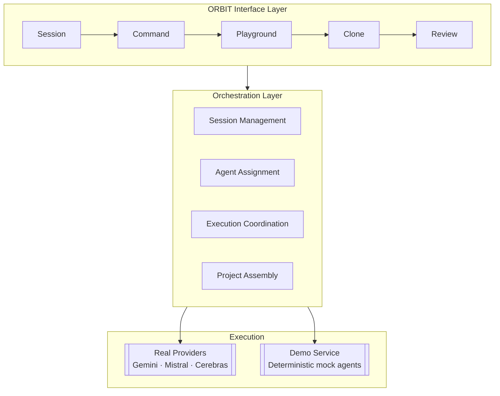
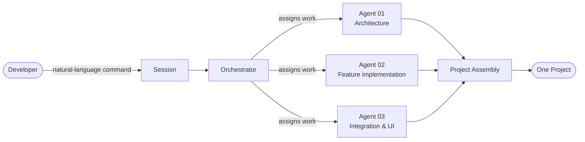

# ORBIT ARCHITECTURE: UNDERLYING TRUTH OF ORBIT

This document describes how ORBIT is put together: the interface layer, the
orchestration layer, provider integrations, and the isolated demo environment.
For the agent roster and execution lifecycle specifically, see
[ORBIT-AGENT.md](./ORBIT-AGENT.md).

## Design Goals

ORBIT separates four concerns so that each can evolve independently:

1. **Interface** : how a developer issues a command and observes a build.
2. **Orchestration** : how a command is decomposed, assigned, and assembled.
3. **Provider integrations** : how each agent actually reaches a model.
4. **Demonstration** : a fully isolated path that reproduces the workflow
   without touching real providers or credentials.

## Layered View

The Product Demo is wired in at the same point as the real providers, but
never shares state, credentials, or execution with them. See
[ORBIT-AGENT.md § Product Demo](./ORBIT-AGENT.md#product-demo) for the
isolation guarantees.

## Request Flow: Command to Project

Agents are assigned distinct responsibilities rather than asked to solve the
same problem independently. The orchestration layer is responsible for
decomposition, dispatch, and reassembly; it holds no model-specific logic
itself, which is what allows providers to be swapped without changing the
workflow.

## Credential Flow (BYOK)

Credentials flow from the developer directly to the provider; ORBIT
orchestrates execution but does not take custody of long-lived keys. Handling
requirements are covered in the repository's security guidelines.

## Component Map

| Layer                | Responsibility                                                          |
|-----------------------|--------------------------------------------------------------------------|
| Interface             | Session creation, command intake, live build visibility, clone/review    |
| Orchestration          | Work decomposition, agent assignment, execution coordination, assembly   |
| Provider integrations | Per-provider request formatting, response handling, credential handoff   |
| Demo service           | Deterministic mock agents and mock files, isolated from real execution   |

## Technology Stack

| Layer          | Technologies                                                    |
|-----------------|-------------------------------------------------------------------|
| Frontend        | React, TypeScript, Vite, Tailwind CSS, Framer Motion, Lucide Icons |
| Backend         | Node.js, Express, TypeScript                                      |
| AI providers    | Google Gemini, Mistral, Cerebras                                  |
| Tooling         | Git, REST APIs, environment-based configuration, modular services |

## Isolation Boundary

The demo path and the real execution path are kept structurally separate at
every layer:

- The demo never calls Gemini, Mistral, or Cerebras.
- The demo never reads BYOK or ORBIT-managed credentials.
- Every file the demo writes is marked with a `/* MOCK FILE */` comment.

This boundary is treated as an architectural invariant, not just a runtime
check: it should remain true even as new providers or agents are added.
