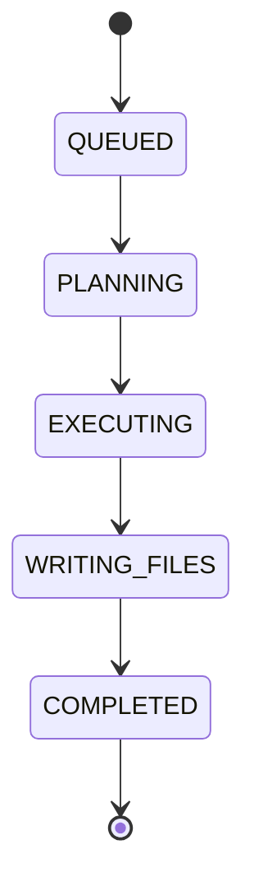

# ORBIT AGENTS: PARALLEL INTELLIGENCE THEORY

This document covers the agent roster, how work is divided between agents,
the lifecycle every agent follows during a build, and the isolation
guarantees of the Product Demo. For how these agents fit into the wider
system, see [ARCHITECTURE.md](./ARCHITECTURE.md).

## Agent Roster

ORBIT coordinates three specialized development agents. Each agent owns a
distinct area of responsibility; agents are not run redundantly against the
same problem.

| Agent    | Provider       | Model                | Responsibility                              |
|----------|-----------------|------------------------|-----------------------------------------------|
| Agent 01 | Google Gemini   | Gemini 3.7 Flash       | Architecture and application structure        |
| Agent 02 | Mistral         | Mistral Small          | Core functionality and feature implementation |
| Agent 03 | Cerebras        | Qwen3 235B Instruct    | Integration, UI, and refinement                |

The exact model configuration is maintained centrally and may change as
providers and models evolve; treat the table above as the current default
rather than a fixed contract.

## Example Work Decomposition

A representative project management build might be divided as follows:

| Agent    | Focus Area                 | Representative Deliverables                              |
|----------|------------------------------|--------------------------------------------------------------|
| Agent 01 | Application architecture     | Project structure, application shell, navigation              |
| Agent 02 | Core functionality           | Task management, filtering, dashboard functionality           |
| Agent 03 | Integration and refinement   | Responsive behavior, component integration, UI refinement     |

The outputs are assembled into a single project rather than merged from
several competing builds.

## Agent Lifecycle

Every agent, real or simulated, moves through the same defined lifecycle.
This is what makes agent activity visible in the Playground rather than
treating execution as a black box.

| State          | Description                                              |
|-----------------|-------------------------------------------------------------|
| QUEUED          | Agent is assigned and waiting on orchestration to start it   |
| PLANNING        | Agent is scoping its assigned responsibility                 |
| EXECUTING       | Agent is generating its contribution                          |
| WRITING FILES   | Agent output is being written into the project                |
| COMPLETED       | Agent's contribution is ready for assembly and review          |

## Provider Credentials (BYOK)

ORBIT supports Bring Your Own Key for each supported provider. Developers
supply their own credentials rather than drawing on an ORBIT-managed credit
system, which keeps model access under the developer's direct control.

| Provider       | Powers                                          |
|-----------------|----------------------------------------------------|
| Google Gemini   | Agent 01 (architecture and application structure)   |
| Mistral         | Agent 02 (core functionality and feature implementation) |
| Cerebras        | Agent 03 (integration, UI, and refinement)           |

Credentials are treated as sensitive at every layer: never committed to
source control, never written to logs, and never exposed in UI output.

## Product Demo

ORBIT includes a deterministic Product Demo, run under a dedicated mock
session (`north-star`), that reproduces the full agent lifecycle without
provisioning real credentials. It does not draw on either of the two real
session slots.

The demo:

- Does not call Gemini, Mistral, or Cerebras.
- Does not use BYOK or ORBIT default credentials.
- Does not execute a real agent or generate a project through an LLM.
- Reproduces the QUEUED → PLANNING → EXECUTING → WRITING FILES → COMPLETED
  lifecycle using deterministic mock agents and mock project files.

Every mock-generated file carries a `/* MOCK FILE */` comment, so the
demonstration is never mistaken for real output.

## Default Agent Service

A future ORBIT-managed execution option, the Default Agent Service, is
planned but not yet available. Until it ships, agent execution depends on
developer-supplied BYOK credentials as described above.
